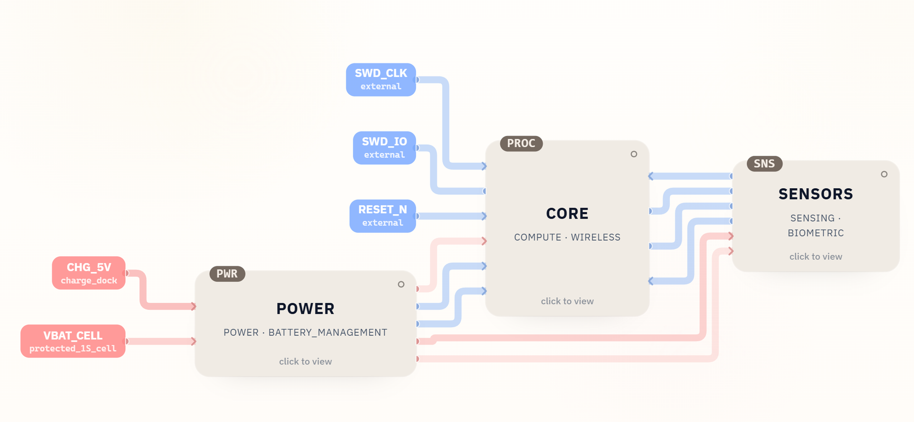
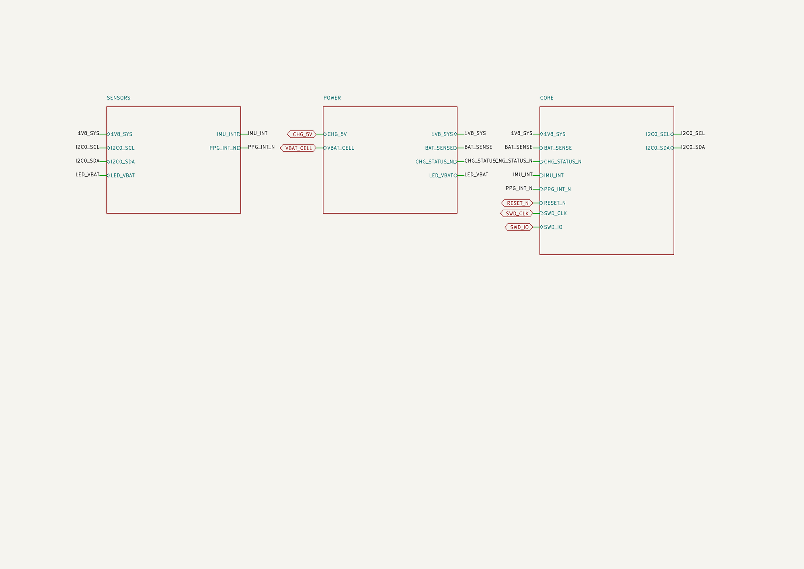

# nRF52832 Smart Ring KiCad Schematic

This repository contains an editable KiCad 10 schematic for a compact smart ring built around the nRF52832. Battery charging and regulation, BLE compute and RF, and optical and motion sensing are separated into three hierarchical sheets for engineering review.

[Download v0.1.1](https://github.com/SpeedUp-Tech/nrf52832-smart-ring-kicad-schematic/releases/tag/v0.1.1) · [Open the live demo](https://speed-up.ai/demo/nrf52832-smart-ring/) · [Read the project case study](https://speed-up.ai/blog/smart-ring-circuit-design-nrf52832-max30101/)

## At a glance

| | |
| --- | --- |
| Main controller | nRF52832-QFAA-R Bluetooth Low Energy SoC |
| Sensing | MAX30101 optical PPG sensor and LIS2DW12 accelerometer |
| Power | MCP73831 single-cell charger and TPS7A0218 1.8 V LDO |
| Interfaces | I2C, sensor interrupts, reset, SWD, and battery sensing |
| Project format | KiCad 10 top-level schematic plus three hierarchical sheets |
| BOM | 25 line items covering 50 placed parts |

## Project scope

The original requirement was to design a smart ring mainly for sleep and heart-rate monitoring. The resulting first draft covers the electronics needed for optical pulse sensing, motion sensing, BLE processing, battery charging, and a regulated 1.8 V system rail.

The complete public requirement is preserved in [PRODUCT_REQUIREMENT.md](PRODUCT_REQUIREMENT.md).

## Schematic structure

| Sheet | Role |
| --- | --- |
| [`POWER`](hardware/modules/POWER.kicad_sch) | Charging input, protected cell connection, charge status, battery sensing, and the `1V8_SYS` rail |
| [`CORE`](hardware/modules/CORE.kicad_sch) | nRF52832, clocks, decoupling, SWD access, BLE antenna path, I2C, and interrupt connections |
| [`SENSORS`](hardware/modules/SENSORS.kicad_sch) | MAX30101 PPG sensor and LIS2DW12 accelerometer on the shared I2C bus |

The module sheets remain editable under `hardware/modules/`. Additional rendered views are available for the [nRF52832 core](evidence/core-schematic.png), [sensor sheet](evidence/sensors-schematic.png), and [charging and power sheet](evidence/power-schematic.png).

## Repository contents

| Path | Contents |
| --- | --- |
| [`hardware/`](hardware/) | Editable KiCad project, top-level schematic, and three hierarchical sheets |
| [`bom/BillOfMaterials.csv`](bom/BillOfMaterials.csv) | Project bill of materials |
| [`evidence/`](evidence/) | Architecture image, requirement capture, and rendered schematic views |
| [`PRODUCT_REQUIREMENT.md`](PRODUCT_REQUIREMENT.md) | Public source requirement |
| [`ENGINEERING_LIMITATIONS.md`](ENGINEERING_LIMITATIONS.md) | Review boundaries and unresolved engineering checks |
| [`LICENSE_SCOPE.md`](LICENSE_SCOPE.md) | License scope for SpeedUp-created project files and documentation |

SpeedUp generated the structured schematic package from the product requirement. Some standalone project-local library exports are intentionally absent from the public package; see [provenance/EXCLUDED_ASSETS.md](provenance/EXCLUDED_ASSETS.md).

## Bill of materials

The included BOM identifies the main first-draft parts and references, including the nRF52832 BLE SoC, MAX30101 PPG sensor, LIS2DW12 accelerometer, MCP73831 charger, TPS7A0218 LDO, chip antenna, crystal, protection parts, decoupling, and test points.

These entries document the generated design choices. They are not approval of part availability, ratings, symbols, footprints, or suitability for a wearable product.

## Open in KiCad

1. Download and extract the [v0.1.1 release](https://github.com/SpeedUp-Tech/nrf52832-smart-ring-kicad-schematic/releases/tag/v0.1.1), or clone this repository.
2. Open `hardware/Smart_Ring.kicad_pro` in KiCad 10 or a compatible version.
3. Review embedded symbols, hierarchy, pin mappings, and footprint assignments before making engineering decisions.

## Engineering status

This is a schematic-stage draft for engineering review. It does not establish electrical validation, safety, compliance, manufacturability, or production readiness.

The next review should focus on battery and charging limits, peak and sleep current, PPG LED current and optical geometry, accelerometer orientation and interrupt behavior, I2C electrical details, RF matching and enclosure detuning, SWD access, component footprints, mechanical fit, skin-contact materials, and the boundary between wellness use and regulated medical claims. See [ENGINEERING_LIMITATIONS.md](ENGINEERING_LIMITATIONS.md) for the full review boundary.

## Licensing and provenance

See [LICENSE_SCOPE.md](LICENSE_SCOPE.md) and [THIRD_PARTY_NOTICES.md](THIRD_PARTY_NOTICES.md). Copyright and license scope do not establish engineering fitness or transfer rights in third-party materials.

## About SpeedUp

SpeedUp is an AI schematic generator that turns product requirements into structured schematic sheets and an editable KiCad project for engineering review.

## Project links

- https://speed-up.ai/blog/smart-ring-circuit-design-nrf52832-max30101/
- https://speed-up.ai/demo/nrf52832-smart-ring/
- https://speed-up.ai/

KiCad is a trademark of the KiCad project. SpeedUp is independent and is not affiliated with or endorsed by the KiCad project.
